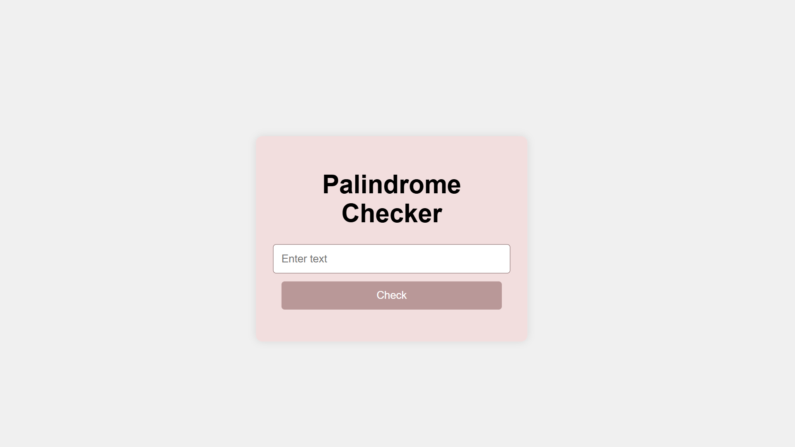

readme# Project Title 🚀
first-js-repo
## Project Description 📝
this palindrome project is a basic sample of JS project created using html css and js codes

## Demo 📸
https://latifa-wakili.github.io/first-js-repo/



## Technologies Used 🛠️

- HTML
- CSS
- JS

## Installation 💻

Provide step-by-step instructions on how to install and set up your project. Include any dependencies or prerequisites that need to be installed.

```bash
# git@github.com:latifa-wakili/first-js-repo.git.
```

```bash
# cd first-js-repo.
```

```bash
# code .
```

## Usage 🎯

```bash
# use git clone .
```

## Author 👩‍💻
- Twitter: [@Latifa_Wakili](https://x.com/WakiliLatifa?t=wlHTh8JuyFprQsN_hZQGWQ&s=08)
- LinkedIn: [Latifa Wakili](https://www.linkedin.com/in/latifa-wakili-68423b277?utm_source=share&utm_campaign=share_via&utm_content=profile&utm_medium=android_app)
- Email: [Latifa Wakili](saavenwakili@gmail.com)

## Contributing 🤝
for team working at first you should creat an organization on git hub nex you can creat pull_request on your project to shear whith your team and work on it together.

